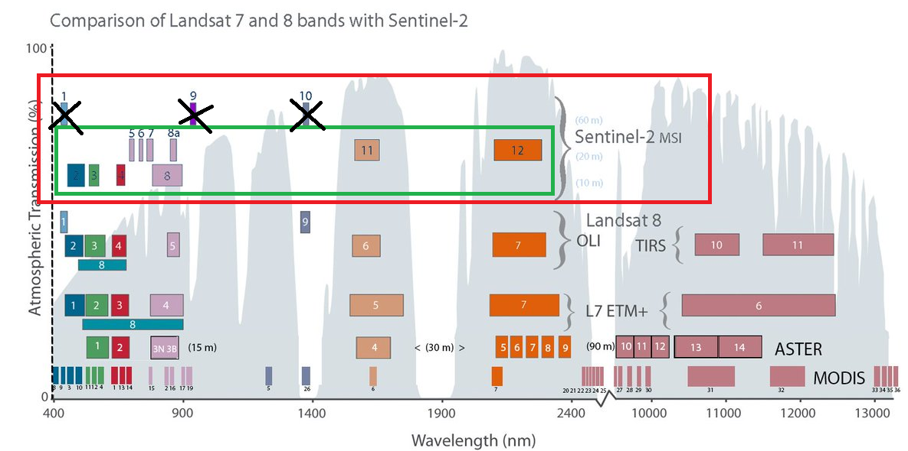
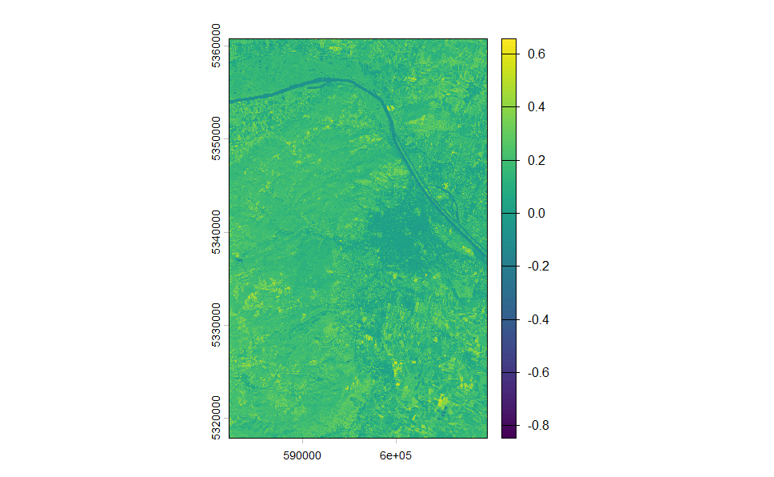
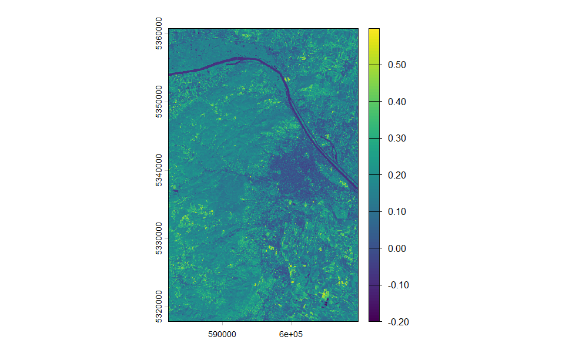
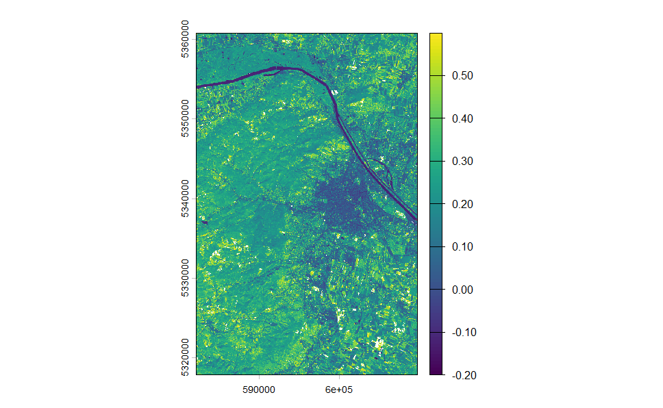
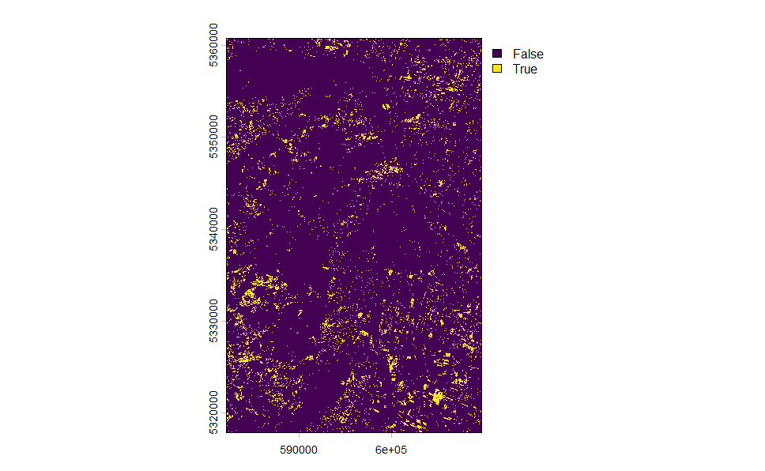
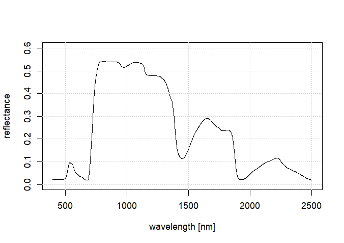
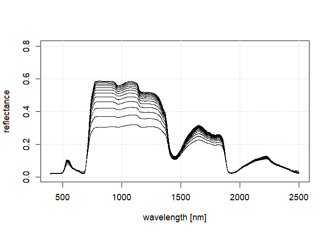
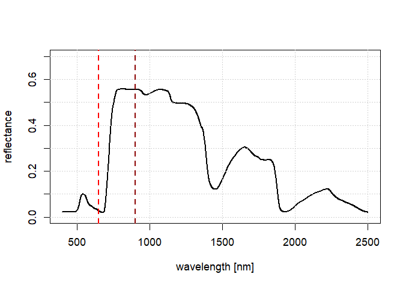
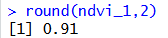

## TEIL 1: Berechnung von Vegetationsindizes in R

### Überblick

Im ersten Teil des heutigen Tutorials werden wir lernen, wie man in R aus Satellitenbildern Vegetationsindizes berechnen kann. 
Wir werden wiederum das Sentinel-2 Satellitenbild von letzter Woche verwenden, das Sie hier finden können:

https://drive.google.com/drive/folders/1IQPJTlW2SKx1sOYTKBII3vTHnofXg1xE?usp=sharing

Falls Sie die Daten nicht mehr vorliegen haben, laden Sie sie bitte erneut herunter und speichern Sie sie in einem Ordner, in dem Sie sie wieder finden können.

### Berechnung des NDVI

Als ersten Schritt werden wir den NDVI berechnen. Wir werden sehen, dass dies eine relativ einfache Aufgabe ist. Die einzige kleine Herausforderung stellt dabei die Auswahl der richtigen Kanäle dar. Unsere vorbereiteten Sentinel-2 Satellitenbilder haben jeweils 10 Kanäle. Die 10 Kanäle entsprechen den Kanälen mit 10 m und 20 m Pixelgröße. 

Diese sind in Abbildung 1 markiert. Es ist wichtig darauf zu achten, dass die Bezeichnungen der Bänder in unseren Datensätzen nicht mehr 1:1 den offiziellen Bezeichnungen des Sentinel-2 Satelliten entsprechen.

**Abbildung 1: Sentinel-2 Bänder**

Da wir die Bänder 1, 9 und 10 (mit 60 m Pixelgröße) gelöscht haben, ist unser Band 1 im Rasterstapel das Band 2 und dementsprechend unser Band 10 im Rasterstapel das Band 12. Es ist auch wichtig darauf zu achten, dass es bei Sentinel-2 insgesamt 5 Bänder gibt, die im nahen Infrarot-Bereich liegen. In der Regel bietet es sich an für die Berechnung des NDVIs das Band 8 zu verwenden, da dieses nativ 10 m Auflösung hat und nicht von 20 m auf 10 m Auflösung geresampled wurde. 

Wie berechnen wir jetzt also den NDVI in R? Zuerst laden wir das Satellitenbild, wie bereits gelernt:

    # Laden des benötigten Paketes
    require(terra)

    # Wechseln des Verzeichnisses
    setwd("E:/Uebungen_Tag7/")

    # Laden des Satellitenbildes
    s2_winter <- rast("Sentinel_2.tif")

Wir können uns das Bild ansehen, um zu überprüfen, ob das Laden richtig funktioniert hat. 

    # Plotten der Satellitenbildszene u
    plotRGB(s2_winter, r=3, g=2, b=1, stretch="hist")

Nun berechnen wir den NDVI. Dafür muss man auf einzelne Kanäle des Satellitenbilds zugreifen. Dies funktioniert über doppelte eckige Klammern und Indizes. Wir haben zwei Optionen, wir können entweder zuerst die zwei benötigten Bänder in separate Variablen speichern, oder wir können in der NDVI Formel direkt auf die Kanäle mit den eckigen Klammern zugreifen. Zuerst die Option mit zwei neuen Variablen:

    # Extraktion des roten Kanals - die Zahl in den eckigen Klammern gibt an welches Band wir extrahieren wollen
    red <- s2_winter[[3]]
    # Extraktion des nahen Infrarot Kanals
    nir <- s2_winter[[7]]

Dann berechnen wir den NDVI mit der bekannten Formel: 

    # Berechnung NDVI
    ndvi_s2_winter <- (nir-red)/(nir+red)

Und plotten das Ergebnis:

    plot(ndvi_s2_winter)

ACHTUNG: Da unser Ergebnisbild nur einen einzelnes Band (den Vegetationindex) beinhaltet, können wir hier den plotRGB Befehl nicht verwenden. Aber der Standard plot() Befehl sollte funktionieren und zum in Abbildung 2 daragestellten Ergebnis führen.

**Abbildung 2: Der berechnete NDVI im Standartplot**

Wir sehen, dass der Kontrast in diesem Bild relativ schlecht ist. Dies wird dadurch verursacht, dass wir im Bild ein paar wenige Pixel mit sehr niedrigen NDVi Werten von -0.8 haben. Der Plot-Befehl passt die dargestellte Farbskala hierauf an. Wenn wir den Kontrast erhöhen wollen, können wir den dargestellten Wertebereich etwas reduzieren. Z.B. auf den Wertebereich -0.2 bis 0.6:

    # Plotten des NDVI-Rasters mit reduzierten Wertebereich
    plot(ndvi_s2_winter, range=c(-0.2, 0.6))

Dies führt zu einem kontrastreicheren Bild wie in Abbildung 3 dargestellt.

**Abbildung 3: Der berechnete NDVI mit angepassten Ploteinstellungen**

Alternativ können wir uns den Weg über die zwei zusätzlichen Variablen auch sparen und den NDVI direkt über den Zugriff auf die Kanäle berechnen:

    ndvi_s2_winter <- (s2_winter[[7]]-s2_winter[[3]])/(s2_winter[[7]]+s2_winter[[3]])

Dies sollte zu einem identischen Ergebnis führen.

### Berechnung des SAVI

Wir verfahren nun analog, um den Soil-adjusted vegetation index (SAVI) zu berechnen:

    # Festlegung des Boden-Parameters
    L = 0.5
    # Berechnung SAVI
    savi = ((nir-red)/(nir+red+L)) * (1+L)
    # ploten des berechneten Index
    plot(savi, range=c(-0.2, 0.6))

Die sollte zur in Abbildung 4 dargestellten Visualisierung führen. Wir sehen, dass die Muster des SAVI ähnlich sind wie die Muster des NDVI, der Kontrast im SAVI aber nochmal deutlich höher zu sein scheint.

**Abbildung 4: Der berechnete SAVI mit angepassten Ploteinstellungen**

### Anwendung eines Schwellenwertes

Als nächsten Schritt wollen wir nun alle photosynthetisch aktiven Vegetationsflächen im Satellitenbild mittels des NDVIs oder des SAVIs identifizieren und uns das Ergebnis als eine binäre Karte ausgeben lassen. Wir gehen davon aus, dass photosynthetisch aktive Vegetationsflächen einen hohen NDVI bzw. SAVI Wert haben. Die Anwendung eines Schwellenwerts auf ein Raster ist in R sehr einfach. Wir verwenden hierfür einfach die größer-kleiner-Zeichen:

    # Selektion aller Pixel mit einem NDVI-Wert größer 0.3
    # Pixel > 0.3 bekommen den Wert 1 zugeordnet, alle anderen den Wert 0
    vegetation <- ndvi_s2_winter > 0.3
    # Plot des resultierenden binären Bildes    
    plot(vegetation)

Die sollte zu einem Plot wie in Abbildung 5 dargestellt führen.

**Abbildung 5: Binäre Karte aller Pixel mit einem VIDVI > 0.3**

Final können wir nun alle erstellten Rasterlayer abspeichern und diese dann z.B. in QGIS ansehen:

    writeRaster(ndvi_s2_winter, file="ndvi_s2_winter.tif")
    writeRaster(savi, file="savi.tif")
    writeRaster(vegetation, file="vegetation.tif")
    
## Hausaufgabe - Teil 1

Berechnen Sie den Bare Soil Index (siehe Vorlesung von heute) und versuchen Sie einen Schwellenwert anzuwenden, der zu einer binären Karte führt, die alle offenen Boden-Flächen von allen anderen Landbedeckungsklassen gut abtrennt. Dokumentieren Sie ihre Arbeit mit einem Screenshot der binären Karte und dem verwendeten Code.

## TEIL 2: Strahlungstransfermodellierung mit PROSAIL

### Überblick

In diesem Tutorial lernen wir das PROSAIL-Strahlungstransfermodell für
Vegetationsoberflächen kennen. Dieses Modell ist in R verfügbar und wir
werden lernen, wie man damit Vorwärtssimulationen durchführt.
Strahlungstransfermodelle wie PROSAIL fassen den aktuellen Wissensstand
über die Wechselwirkung zwischen elektromagnetischer Strahlung im
Wellenlängenbereich von 400 bis 2500 nm und Vegetation zusammen. Sie
sind ein interessantes Werkzeug für wissenschaftliche Studien, aber
auch, um besser zu verstehen, wie bestimmte Pflanzeneigenschaften die
Reflexionseigenschaften von Vegetation beeinflussen.

In unserem Beispiel werden wir zuerst einige Vegetationsspektren simulieren und
diese danach für die Berechnung von NDVI-Werten verwenden. Wir werden feststellen,
dass verschiedene Kombinationen von Pflanzeneigenschaften zu ähnlichen NDVI-Werten
führen können.

### Lernziele

Die Lernziele dieses Tutorials umfassen:

-   Erlernern der Fähigkeit PROSAIL im Vorwärtsmodus in R zu verwenden
-   Verstehen, wie die in PROSAIL implementierten Pflanzeneigenschaften
    die Reflexionseigenschaften von Vegetation beeinflussen
-   Ein besseres Verständnis des NDVI

### Verwendete Datensätze

In diesem Tutorial werden keine externen Datensätze verwendet.

### Schritt 1: Ausführen von PROSAIL im Vorwärtsmodus

Um PROSAIL im Vorwärtsmodus auszuführen, müssen wir zunächst mehrere Pakete herunterladen und installieren. Dies können wir wie folgt tun (detaillierte Infos auch hier: https://github.com/jbferet/prosail):

    # installieren des Pakets "remotes" welches es erlaubt Pakete von github zu installieren
    install.packages("remotes")
    # Installation des Pakets "prospect" (von der github seite von Jean Baptiste Feret (jbferet))
    remotes::install_github('jbferet/prospect')

Sollten bei der Ausführung der zweiten Zeile eine Anfrage bezüglich Updates von Pakete kommen, so können wir "1" eingeben und mit "Enter" bestätitgen um alle Pakete updaten. Anschließend werden wir noch das **prosail** Paket installieren mit:

    remotes::install_github('jbferet/prosail')

Wenn alle Pakete erfolgreich installier wurden, sind wir bereit das PROSAIL-Model im Vorwärtsmodus zu betreiben. Ein ausführliches Tutorial hierzu findet sich hier:

https://jbferet.gitlab.io/prosail/articles/prosail2.html

Das prosail-Paket, welches wir hier verwenden, bietet sehr umfangreiche und detaillierte Simulationsmöglichkeiten, die weit über das Ziel des Tutorials hinausgehen. Das Tutorial war ursprünglich für eine deutlich einfachere R-Implementierung von PROSAIL verfasst worden. Da diese einfachere Implementierung aber nicht mehr mit den aktuellen R Versionen kompatibel ist, verwenden wir nun diese komplexere Version. Wir werden daher nicht alle zur Verfügung stehenden Funktionen benutzen, sondern uns auf die grundsätzliche Vorwärtssimulation konzentrieren.

Um eine Vorwärtssimulation durchzuführen, müssen wir eine umfangreiche Zahl an Vegetations- und Beobachtungsgeometrie-Parametern definieren um, dann ein den gesetzten Parametern entsprechendes Vegetationsspektrum zu simulieren. Der folgende Code wird hierfür verwendet (bitte die Kommentare sorgfältig durchlesen):

    # Laden des prosail Pakets
    library(prosail)
    # Definieren der Pflanzeneigenschaften auf Blattebene
    # Für die Simulation von Spektren von Blättern, wird das Modell "PROSPECT" verwendet
    input_prospect <- data.frame('chl' = 40, 'car' = 8, 'ant' = 0.0, 
                                 'ewt' = 0.01, 'lma' = 0.009, 'n_struct' = 1.5)
    # dabei stehen die jeweiligen Abkürzungen für:
    # chl = Chlorophyllgehalt
    # car = Carotenoidgehalt
    # ant = Anthocyaningehalt
    # ewt = equivalent water thickness
    # lma = leaf mass per area
    # n_struct = Strukturparameter des Blattes (vereinfacht: wie "dick" ist das Blatt; korrekter:
    # wieviele Ebenen an Parenchymzellen an denen eine Zellwand an Luft angrenzt gibt es)  
                                 
    # Für die Simulation von Vegetationsspektren auf "Canopy"-Ebene (Kronendach bzw. Grasland) wird
    # ein weitere Modell namens "SAIL" verwendet, welches zusätzliche Informationen zur Verteilung
    # der Blätter und der Beobachtungsgeometrie benötigt:
    lai <- 5        # LAI (leaf area index - wieviel Blattfläche pro Bodengrundfläche)
    hotspot <- 0.1  # Hot spot parameter (Intensität des Hotspot-Effekt => hängt von der Vegetationsart ab)
    type_lidf <- 2  # leaf inclination distribution function (Blattwinkelverteilung)
    lidf_a <- 30    # mean leaf angle (mittlerer Blattwinkel)
    tts <- 30       # geometry of acquisition: sun zenith angle (Sonnenzenithwinkel)
    tto <- 10       # geometry of acquisition: observer zenith angle (Beobachtungszenithwinkel)
    psi <- 90       # geometry of acquisition: sun-observer azimuth (Azimuthwinkel zwischen Sonne und BeobachterIn)
    rsoil <- spec_soil_atbd_v2$soil_01 # soil reflectance (Bodenspektrum)
    # verschiedene Bodenspektren sind verfügbar:
    # - spec_soil: dark ($min_refl) and bright ($max_refl) soil reflectance (heller und dunkler Boden)
    # - spec_soil_atbd_v2 : selection of 7 reflectance spectral used in S2 ATBD v2 (7 im Feld gemessene Bodenspektren)
    # - spec_soil_ossl: selection of 47 reflectance spectral representative of OSSL (weitere 47 im Feld gemessene Spektren)
    

Nachdem alle Parameter definiert wurde, können wir PROSAIL im Vorwärtsmodus laufen lassen und ein simuliertes Spektrum erstellen. Hierfür verwenden wir folgenden Code:

    refl_prosail <- prosail(input_prospect = input_prospect, 
                            type_lidf = type_lidf, lidf_a = lidf_a, lai = lai,
                            hotspot = hotspot, tts = tts, tto = tto, psi = psi, 
                            rsoil = rsoil)
    
Wie bereits angedeutet, ist das hier verwendete PROSAIL Model relativ komplex und dementsprechend ist der Output von der "prosail"-Funktion nicht einfach nur ein einzelnes Spektrum sondern es werden insgesamt 9 Outputs erstellt. Konkret wird z.B. unterschieden zwischen hemisphärischer Abstrahlung (die in alle Richtungen einer imaginäre Halbkugel über der Vegetation erfolgt) und bidirektionalen Effekten (d.h., dass Strahlung in bestimmte Richtungen aufgrund der Sonnen-Beobachter-Geometrie in unterschiedlicher Intesität reflektiert wird). In unserem konkreten Fall führt dies zu weit und wir werden daher diese Ergebnisse vereinfachen zu einem einzelnen Spektrum, welches die Reflektanz in Richtung des Beobachters repräsentiert:

# Reduktion der komplexen prosail-Ausgaben in ein einzelnes Spektrum in Richtung des Beobachters
surf_refl_4SAIL <- get_surf_refl(rdot = refl_prosail$rdot,
                                 rsot = refl_prosail$rsot,
                                 tts = tts,
                                 spec_atm_sensor = spec_atm)

Um das resultierende Spektrum zu plotten, führen wir folgenden Code aus:

    # plot des Spektrum
    plot(400:2500, surf_refl_4SAIL[,1], type="l", ylab="reflectance", xlab="wavelength [nm]", ylim=c(0,0.6), xlim=c(400,2500))
    grid()

Dies führt zu der folgenden Darstellung:

**Abbildung 6: Darstellung des simulierten Spektrums**

Ein wichtiger Punkt ist, dass die Variable **veg_spectrum** nur die
Reflexionswerte (y-Achse) enthält, während die zugehörigen Wellenlängen
nicht direkt verfügbar sind. Wir müssen daher wissen, dass PROSAIL die Reflexion der 
Vegetationsschicht für Wellenlängen zwischen 400 und 2500 nm (in Schritten von 1 nm)
simuliert. Wir können die Reflexionswerte daher darstellen, indem wir
eine Sequenz (**400:2500**) als x-Werte verwenden.

Sie können nun ein wenig mit diesem einfachen Aufruf von PROSAIL
experimentieren und beobachten, wie sich das Spektrum verändert, wenn
Sie eine oder mehrere Vegetationseigenschaften (die Input zur prospect bzw. prosail Funktion) ändern.

### Schritt 2: Untersuchung des Einflusses einzelner Parameter auf das PROSAIL-Signal

Im nächsten Schritt schauen wir uns an, wie sich die simulierten Spektren verändern, wenn wir einen der Parameter systematisch verändern. Konkret schauen wir uns den Parameter LAI an, da dieser einen relativ starken Einfluss auf die Amplitude (die Höhe der Reflentanz) des Spektrums hat.

Dazu erstellen wir zunächst einen variable names **lai_loop** in der wir einen Vektor erstellen in dem Zahlen von 1 bis 7 in Schritten von 0.5 abgespeichert sind. LAI-Werte von 1-7 decken die typische Variabilität in Wäldern und Grasländern ganz gut ab:

    lai_loop <- seq(1,7,0.5)
    lai_loop

Als nächstes erstellen wir eine leere **Liste** names **res**. Wie bereits in einem früheren Tutorial gelernt sind Listen ein Speichercontainer in R in dem wir flexibel Ergebnisse speichern können.
    
    res <- list()

Nun verwenden wir einen for-loop (kennen wir ebenfalls bereit) in dem wir durch die verschiedenen Einträge in der **lai-loop** Variable gehen und jeweils dem Parameter **lai** in der **prosail**-Funktion den aktuellen Wert des aktuellen Durchlaufs geben. D.h., für i=1 (erster Durchlauf) ist der LAI = 1, für i=2 (zweiter Durchlauf) ist der LAI=1.5 usw.

    # Beginn des for-loops
    for (i in 1:length(lai_loop)){

      # Simulieren des Spektrums. Der Parameter lai ändert sich bei jedem Durchlauf da immer der i-ste Wert im Vektor "lai-loop" verwendet wird
      refl_prosail <- prosail(input_prospect = input_prospect, 
                              type_lidf = type_lidf, lidf_a = lidf_a, lai = lai_loop[i],
                              hotspot = hotspot, tts = tts, tto = tto, psi = psi, 
                              rsoil = rsoil)
      
      # Reduktion zu einem einzelnen Spektrum
      surf_refl_4SAIL <- get_surf_refl(rdot = refl_prosail$rdot,
                                       rsot = refl_prosail$rsot,
                                       tts = tts,
                                       spec_atm_sensor = spec_atm)

      # Speichern des aktuellen Spektrums in die Liste (am Schluss werden wir 14 Spektren in der Liste haben)
      res[[i]] <- surf_refl_4SAIL
      
    }

    # Umwandlung der Liste in einen data.frame
    res_df <- do.call(cbind, res)
    
Nachdem wir alle Spektren erfolgreich simuliert haben, plotten wir alle 14 Spektren in ein einzelnes Plotfenster. Dafür wenden wir wiederum den Trick an, dass wir zuerst nur ein Spektrum plotten und danach mit dem for-loop alle anderen 13 Spektren "hinterherplotten" aber dabei die Achsen und die Achsenbeschriftungen nicht mehr plotten.

    plot(400:2500, res_df[,1], type="l", ylab="reflectance", xlab="wavelength [nm]", ylim=c(0,0.8), xlim=c(400,2500))
    for (i in 2:14){
      par(new=T)
      plot(400:2500, res_df[,i], type="l", ylab="", xlab="", axes=F, ylim=c(0,0.8), xlim=c(400,2500))
    }
    grid()

Dies führt zu folgender Ausgabe:

Dieser Plot zeigt, wie sich die Spektren der Vegetation verändern, wenn
sich der LAI ändert. Sie können weiter mit diesem Code experimentieren,
andere Parameter variieren und z. B. Farben anpassen, um besser zu
erkennen, welche Kurve welchem LAI-Wert entspricht.

Bitte verwenden Sie diesen Code auch für die Bearbeitung der Übungen 1
und 2 der heutigen Vorlesung. Denken Sie daran, dass sinnvolle
Wertebereiche für alle in PROSAIL berücksichtigten Parameter in den
Folien der Übungen für heute zu finden sind.

### Schritt 3: Simulation von NDVI-Werten mit PROSAIL

In diesem letzten Schritt simulieren wir zunächst ein Spektrum und
berechnen daraus den NDVI. Anschließend sollen Sie versuchen, bestimmte
NDVI-Werte zu erzeugen.

Zunächst berechnen wir ein Spektrum:

      # Simulieren des Spektrums. Der Parameter lai ändert sich bei jedem Durchlauf da immer der i-ste Wert im Vektor "lai-loop" verwendet wird
      refl_prosail <- prosail(input_prospect = input_prospect, 
                              type_lidf = type_lidf, lidf_a = lidf_a, lai = 5,
                              hotspot = hotspot, tts = tts, tto = tto, psi = psi, 
                              rsoil = rsoil)
      
      # Reduktion zu einem einzelnen Spektrum
      surf_refl_4SAIL <- get_surf_refl(rdot = refl_prosail$rdot,
                                       rsot = refl_prosail$rsot,
                                       tts = tts,
                                       spec_atm_sensor = spec_atm)

Zur Visualisierung der NDVI-Bänder definieren wir die Wellenlängen für
NIR (900 nm) und RED (650 nm). In beiden Fällen ziehen wir 399 ab, da
die Spektren bei 400 nm beginnen:

    nir_band = 900-399
    red_band = 650-399

Nun plotten wir das Spektrum und markieren die Positionen der
NDVI-Bänder:

    plot(400:2500, surf_refl_4SAIL[,1], type="l", ylab="reflectance", xlab="wavelength [nm]", ylim=c(0,0.7), xlim=c(400,2500), lwd=2)
    grid()
    abline(v=nir_band+399, lty=2, col="darkred", lwd=2)
    abline(v=red_band+399, lty=2, col="red", lwd=2)

Dies ergibt folgenden Plot:

**Abbildung 9: Das simulierte Spektrum mit Markierung der zwei Wellenlängen, die für die Berechnung des NDVI verwendet werden werden**

Nun können wir den NDVI berechnen:

    ndvi_1 = (surf_refl_4SAIL[nir_band,] - surf_refl_4SAIL[red_band,]) / (surf_refl_4SAIL[nir_band,] + surf_refl_4SAIL[red_band,])

Und uns ausgeben lassen. Der Befehl **round()**  sorgt dafür, dass wir den NDVI mit nur zwei Stellen hinter dem Komma ausgeben:

    round(ndvi_1,2)

Dies ergibt:

**Abbildung 10: Ausgabe des berechneten NDVI-Werten**

## Hausaufgabe - Teil 2

Versuchen Sie, durch Variation der PROSAIL-Parameter NDVI-Werte von 0.20,
0.40 und 0.80 zu erzeugen. Notieren Sie die PROSAIL-Paramter mit denen sie die jeweiligen NDVI-Werte erhalten haben. Prüfen Sie auch, ob mehrere
Parameterkombinationen zu denselben NDVI-Werten führen, und überlegen
Sie, was das für die Aussagekraft des NDVI bedeutet.

### Abschluss

Damit sind wir am Ende dieses kurzen Einblicks in die Welt der
Strahlungstransfermodelle. Diese Modelle helfen dabei zu verstehen, wie
Pflanzeneigenschaften die Reflexion elektromagnetischer Strahlung
beeinflussen. In Kombination mit hochauflösenden Fernerkundungsdaten
können sie ein sehr leistungsfähiges Werkzeug sein, insbesondere für
Modellinversionen.
