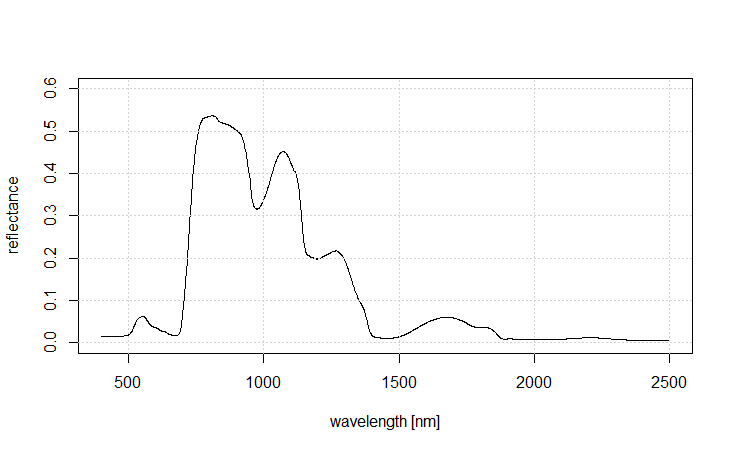
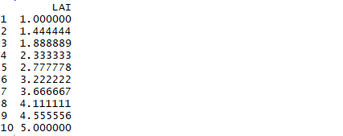
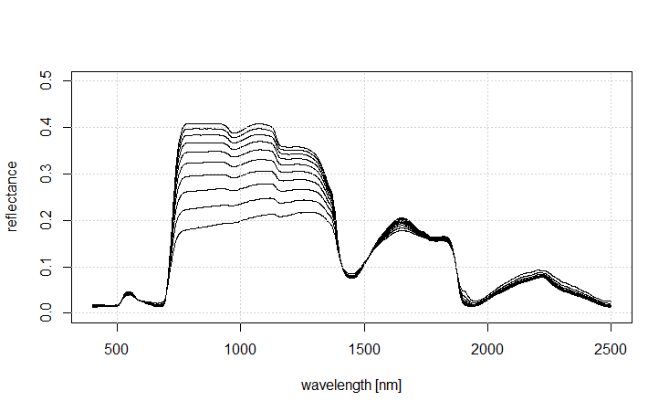
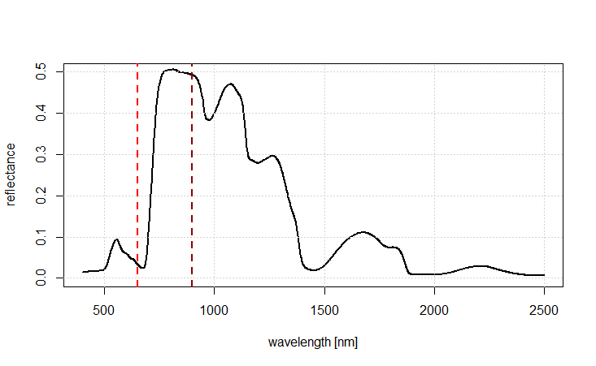
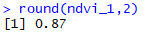

## TEIL 1: Berechnung von Vegetationsindizes in R

### Überblick

Im ersten Teil des heutigen Tutorials werden wir lernen, wie man in R aus Satellitenbildern Vegetationsindizes berechnen kann. 
Wir werden wiederum die drei Sentinel-2 Satellitenbilder von letzter Woche verwenden, die sie hier finden können:

https://drive.google.com/drive/folders/1IQPJTlW2SKx1sOYTKBII3vTHnofXg1xE?usp=sharing

Falls Sie die Daten nicht mehr vorliegen haben, laden Sie sie bitte erneut herunter und speichern Sie sie in einem Ordner, in dem Sie sie wieder finden können.

### Berechnung des NDVI

Als ersten werden wir den NDVI berechnen. Wir werden sehen, dass dies eine relativ einfache Aufgabe ist. Die einzige kleine Herausforderung stellt dabei die Auswahl der richtigen Kanäle dar. Unsere vorbereiteten Sentinel-2 Satellitenbilder haben jeweils 10 Kanäle. Die 10 Kanäle entsprechen den Kanälen mit 10 m und 20 m Pixelgröße. 

Diese sind in Abbildung 1 markiert. Es ist wichtig darauf zu achten, dass die Bezeichnungen der Bänder in unseren Datensätzen nicht mehr 1:1 den offiziellen Bezeichnungen des Sentinel-2 Satelliten entsprechen.

Da wir die Bänder 1, 9 und 10 (mit 60 m Pixelgröße) gelöscht haben ist unser Band 1 im Rasterstapel das Band 2 und dementsprechend unser Band 10 im Rasterstapel das Band 12. Es ist auch wichtig darauf zu achten, dass es bei Sentinel-2 insgesamt 5 Bänder gibt, die im nahren Infrarot-Bereich liegen. In der Regel bietet es sich an für die Berechnung des NDVIs das Band 8 zu verwenden, da dieses nativ 10 m Auflösung hat und nicht von 20 m auf 10 m Auflösung geresampled wurde. 

Wie berechnen wir jetzt also den NDVI in R? Zuerst laden wir das Satellitenbild, wie bereits gelernt:

    # Laden des benötigten Paketes
    require(terra)

    # Wechseln des Verzeichnisses
    setwd("E:/Uebungen_Tag7/")

    # Laden des ersten Satellitenbildes
    s2_winter <- rast("Sentinel_2.tif")

Wir können uns das Bild ansehen, um zu überprüfen, ob das Laden richtig funktioniert hat. 

    # Plotten der Satellitenbildszene u
    plotRGB(s2_winter, r=3, g=2, b=1, stretch="hist")

Nun berechnen wir den NDVI. Dafür muss man auf einzelne Kanäle zugreifen. Dies funktioniert über doppelte eckige Klammern. Wir haben zwei Optionen, wir können entweder zuerst die zwei benötigten Bänder in separate Variablen speichern, oder wir können in der NDVI Formel direkt auf die Kanäle mit den eckigen Klammern zugreifen. Zuerst die Option mit zwei neuen Variablen:

    # Extraktion des roten Kanals:
    red <- s2_winter[[3]]
    nir <- s2_winter[[7]]

Dann berechnen wir den NDVI mit der bekannten Formel: 

    # Berechnung NDVI
    ndvi_s2_winter <- (nir-red)/(nir+red)

Und plotten das Ergebnis:

    plot(ndvi_s2_winter)

ACHTUNG: Da unser Ergebnisbild nur einen einzelnes Band (den Vegetationindex) beinhaltet können wir hier den plotRGB Befehl nicht verwenden. Aber der Standard plot() Befehl sollte funktionieren und zum in Abbildung 2 daragestellten Ergebnis führen.

Alternativ können wir uns den Weg über die zwei zusätzlichen Variablen auch sparen:

    ndvi_s2_winter <- (s2_winter[[7]]-s2_winter[[3]])/(s2_winter[[7]]+s2_winter[[3])

Dies sollte zu einem identischen Ergebnis führen.
    

## TEIL 2: Strahlungstransfermodellierung mit PROSAIL

### Überblick

In diesem Tutorial lernen wir das PROSAIL-Strahlungstransfermodell für
Vegetationsoberflächen kennen. Dieses Modell ist in R verfügbar und wir
werden lernen, wie man damit einige Vorwärtssimulationen durchführt.
Strahlungstransfermodelle wie PROSAIL fassen den aktuellen Wissensstand
über die Wechselwirkung zwischen elektromagnetischer Strahlung im
Wellenlängenbereich von 400 bis 2500 nm und Vegetation zusammen. Sie
sind ein interessantes Werkzeug für wissenschaftliche Studien, aber
auch, um besser zu verstehen, wie bestimmte Pflanzeneigenschaften die
Reflexionseigenschaften von Vegetation beeinflussen.

In unserem Beispiel werden wir zuerst einige Vegetationsspektren simulieren und
diese danach für die Berechnung von NDVI-Werten verwenden. Wir werden feststellen,
dass verschiedene Kombinationen von Pflanzeneigenschaften zu ähnlichen NDVI-Werten
führen können.

### Lernziele

Die Lernziele dieses Tutorials umfassen:

-   Ausführen von PROSAIL im Vorwärtsmodus
-   Verstehen, wie die in PROSAIL implementierten Pflanzeneigenschaften
    die Reflexionseigenschaften von Vegetation beeinflussen
-   Ein besseres Verständnis des NDVI

### Verwendete Datensätze

In diesem Tutorial werden keine externen Datensätze verwendet.

### Schritt 1: Ausführen von PROSAIL im Vorwärtsmodus

Um PROSAIL im Vorwärtsmodus auszuführen, müssen wir zunächst ein Paket
namens "hsdar" herunterladen und installieren. Dies können wir wie folgt
tun:

    install.packages("hsdar")
    library(hsdar)

Anschließend können wir uns die Hilfeseite der Hauptfunktion des
hsdar-Pakets ansehen, die "PROSAIL" heißt:

    ?PROSAIL

Wenn Sie sich den Funktionsaufruf ansehen, werden Sie feststellen, dass
es relativ einfach ist, ein Spektrum mit der PROSAIL-Funktion zu
simulieren. Sie müssen im Wesentlichen nur Werte für alle
Pflanzeneigenschaften sowie zusätzlich für die Sonnen-Sensor-Geometrie
definieren und die Funktion ausführen. Falls Sie nicht alle Parameter
angeben, werden für die verbleibenden Parameter Standardwerte verwendet.

Nun sind wir bereit, eine erste PROSAIL-Simulation durchzuführen. Dazu
definieren wir die Vegetationseigenschaften innerhalb der
PROSAIL-Funktion:

    # simulate and plot simple vegetation spectrum
    #######################################################
    veg_spectrum = spectra(PROSAIL(LAI=7, Cab = 40, Car=10, Cw = 0.1, Cm = 0.005, N=2, TypeLidf = 2, lidfa = 55))

Wie Sie sehen, rufen wir die PROSAIL-Funktion innerhalb einer weiteren
Funktion namens "spectra()" auf. Diese Funktion extrahiert direkt das
resultierende Spektrum aus dem "speclib"-Objekt, das von der
PROSAIL-Funktion erzeugt wird. Diese speclib-Objekte enthalten viele
zusätzliche Informationen über den Funktionsaufruf usw., und es wäre
auch möglich, diese Objekte direkt zu plotten. Die Verwendung der
spectra()-Funktion bietet jedoch Vorteile für einige der folgenden
Darstellungen, weshalb wir diesen Ansatz hier bereits einführen.

Um das Spektrum zu plotten, führen wir folgenden Code aus:

    # plot spectrum
    plot(400:2500, veg_spectrum[1,], type="l", ylab="reflectance", xlab="wavelength [nm]", ylim=c(0,0.5), xlim=c(400,2500))
    grid()

Dies führt zu der folgenden Darstellung:

Ein wichtiger Punkt ist, dass die Variable **veg_spectrum** nur die
Reflexionswerte (y-Achse) enthält, während die zugehörigen Wellenlängen
nach Anwendung der Funktion "spectra()" nicht mehr verfügbar sind. Wir
müssen daher wissen, dass PROSAIL die Reflexion der Vegetationsschicht
für Wellenlängen zwischen 400 und 2500 nm (in Schritten von 1 nm)
simuliert. Wir können die Reflexionswerte daher darstellen, indem wir
eine Sequenz (**400:2500**) als x-Werte verwenden.

Sie können nun ein wenig mit diesem einfachen Aufruf von PROSAIL
experimentieren und beobachten, wie sich das Spektrum verändert, wenn
Sie eine oder mehrere Vegetationseigenschaften ändern.

### Schritt 2: Untersuchung des Einflusses einzelner Parameter auf das PROSAIL-Signal

Das hsdar-Paket bietet eine praktische Möglichkeit, mehrere Spektren
gleichzeitig zu simulieren. Dazu müssen wir einen Dataframe definieren,
in dem Wertebereiche für die zu variierenden Pflanzeneigenschaften
gespeichert sind. Im folgenden Beispiel variieren wir nur einen
Parameter und lassen die übrigen auf ihren Standardwerten.

Dazu erstellen wir zunächst einen Dataframe namens **parameter**, in dem
wir eine Spalte "LAI" definieren und 10 verschiedene Werte speichern:

    # simulate and plot multiple vegetation spectra
    #######################################################

    # define parameter space
    parameter <- data.frame(LAI = seq(1,5, length.out=10))
    parameter

Dies führt zu folgender Ausgabe:

Es ist natürlich auch möglich, mehrere Parameter gleichzeitig zu
variieren. Um zu sehen, wie das funktioniert, schauen Sie sich bitte die
Hilfe der "PROSAIL"-Funktion an. In unserem Fall rufen wir nun die
PROSAIL-Funktion erneut auf und verwenden den zusätzlichen Parameter
"**parameterList**", den wir auf den zuvor erstellten Dataframe setzen:

    veg_spectra = spectra(PROSAIL(parameterList = parameter))

Dies erzeugt insgesamt 10 Spektren. Anschließend plotten wir alle
Spektren nacheinander mit einer for-Schleife:

    # plot spectrum
    plot(400:2500, ylab="reflectance", xlab="wavelength [nm]", ylim=c(0,0.5), xlim=c(400,2500))
    for(i in 1:nrow(veg_spectra)){
      lines(400:2500, veg_spectra[i,])
    }
    grid()

Dies führt zu folgendem Plot:

Dieser Plot zeigt, wie sich die Spektren der Vegetation verändern, wenn
sich der LAI ändert. Sie können weiter mit diesem Code experimentieren,
andere Parameter variieren und z. B. Farben anpassen, um besser zu
erkennen, welche Kurve welchem LAI-Wert entspricht.

Bitte verwenden Sie diesen Code auch für die Bearbeitung der Übungen 1
und 2 der heutigen Vorlesung. Denken Sie daran, dass sinnvolle
Wertebereiche für alle in PROSAIL berücksichtigten Parameter in den
Folien angegeben sind.

### Schritt 3: Simulation von NDVI-Werten mit PROSAIL

In diesem letzten Schritt simulieren wir zunächst ein Spektrum und
berechnen daraus den NDVI. Anschließend sollen Sie versuchen, bestimmte
NDVI-Werte zu erzeugen.

Zunächst berechnen wir ein Spektrum:

    # simulate and calculate NDVI
    #######################################################

    veg_spectrum_1 = spectra(PROSAIL(LAI=5, Cab = 25, Car=10, Cw = 0.05, Cm = 0.005, N=2, TypeLidf = 2, lidfa = 55))[1,]

Zur Visualisierung der NDVI-Bänder definieren wir die Wellenlängen für
NIR (900 nm) und RED (650 nm). In beiden Fällen ziehen wir 399 ab, da
die Spektren bei 400 nm beginnen:

    nir_band = 900-399
    red_band = 650-399

Nun plotten wir das Spektrum und markieren die Positionen der
NDVI-Bänder:

    plot(400:2500, veg_spectrum_1, type="l", ylab="reflectance", xlab="wavelength [nm]", ylim=c(0,0.5), xlim=c(400,2500), lwd=2)
    grid()
    abline(v=nir_band+399, lty=2, col="darkred", lwd=2)
    abline(v=red_band+399, lty=2, col="red", lwd=2)

Dies ergibt folgenden Plot:

Nun können wir den NDVI berechnen:

    ndvi_1 = (veg_spectrum_1[nir_band] - veg_spectrum_1[red_band]) / (veg_spectrum_1[nir_band] + veg_spectrum_1[red_band])

Zur Ausgabe:

    round(ndvi_1,2)

Dies ergibt:

### Hausaufgabe

Versuchen Sie, durch Variation der PROSAIL-Parameter NDVI-Werte von 0.20,
0.40 und 0.80 zu erzeugen. Prüfen Sie auch, ob mehrere
Parameterkombinationen zu denselben NDVI-Werten führen, und überlegen
Sie, was das für die Aussagekraft des NDVI bedeutet.

### Abschluss

Damit sind wir am Ende dieses kurzen Einblicks in die Welt der
Strahlungstransfermodelle. Diese Modelle helfen dabei zu verstehen, wie
Pflanzeneigenschaften die Reflexion elektromagnetischer Strahlung
beeinflussen. In Kombination mit hochauflösenden Fernerkundungsdaten
können sie ein sehr leistungsfähiges Werkzeug sein, insbesondere für
Modellinversionen.
